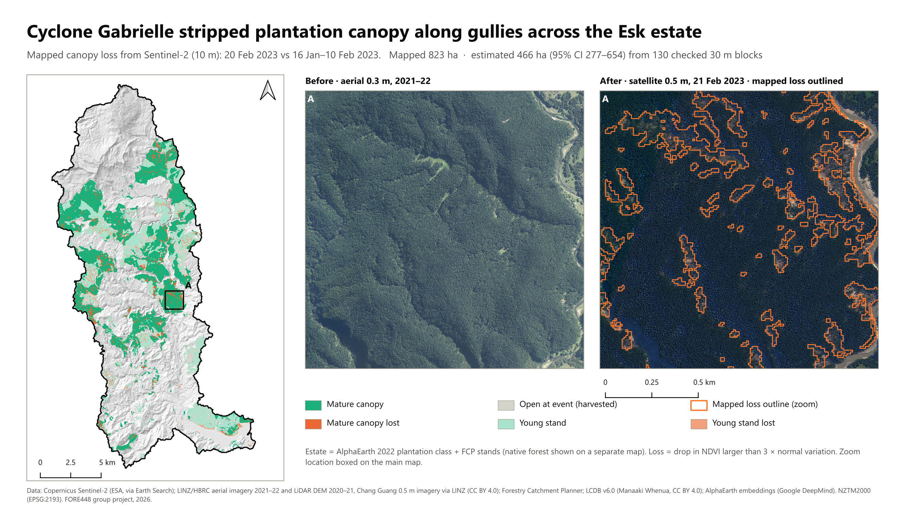

# Plantation canopy loss in the Esk catchment after Cyclone Gabrielle

How much plantation forest canopy did Cyclone Gabrielle (13–14 February 2023) strip from the Esk catchment in Hawke's Bay, New Zealand, and where was the loss concentrated? This repository holds the full analysis pipeline: a 10 m Sentinel-2 loss map, a blind stratified reference sample interpreted on 0.1–0.5 m imagery, a design-based area estimate with confidence intervals, and a comparison of optical, radar and embedding-based change indicators.

FORE448 group project, University of Canterbury, 2026: Max Aitken, Ashan Barr, Steven Cooper.



## Result

**466 ha of plantation canopy was lost (95% CI 277–654 ha), about 7% of the plantation canopy standing before the storm.** Loss was concentrated on steep slopes and beside streams, and hardest in young stands and recent cutover.

| | Loss (95% CI) | Share of canopy lost |
|---|---|---|
| Mature plantation | 194 ha (82–306) | 4.3% |
| Young stands and recent cutover | 272 ha (120–423) | 15.2% |
| **Whole estate** | **466 ha (277–654)** | **7.4%** |

- The uncorrected Sentinel-2 map flagged 823 ha; the reference sample corrected this to 466 ha (the map overstated mature loss about 2.7×).
- Sensitivity to how stands harvested during 2022 are treated: 638 ha if counted as canopy, 399 ha if 2021–22 harvest is excluded.
- Map-based loss rates rise from about 5% of canopy on slopes under 15° to 24% above 35°, and from 7% beyond 200 m of a stream to 20% within 20 m.
- Separation of verified loss from intact canopy (AUC): Sentinel-2 NDVI 0.90, NBR 0.86, AlphaEarth embedding change 0.75, Sentinel-1 VH/VV 0.69.

All numbers come from `provenance/s17_final_estimate.json` and the other JSON files in `provenance/`, which the scripts write.

## Approach

| Step | What was done | Scripts |
|---|---|---|
| 1. Define the forest | Plantation estate (9,525 ha) from a random-forest classifier on 2022 AlphaEarth embeddings plus Forestry Catchment Planner stands, checked against LCDB v6.0; each pixel classed as mature, young or open cutover at the storm | `s08`, `s14`, `s09`, `s15` |
| 2. Map the change | Sentinel-2 ΔNDVI between a Jan–Feb 2023 median and 20 Feb 2023; loss where the drop exceeds median − 3 × MAD within each stand class (thresholds set without reference labels) | `s01a`, `s01b`, `s09` |
| 3. Check it | 130 blocks of 30 × 30 m in six strata, labelled blind with 16 dots each on before/after imagery; positional offset between imagery and Sentinel-2 measured and corrected; second interpreter on 30 blocks | `s17`–`s17h` |
| 4. Estimate area | Stratified estimator (Olofsson et al., 2014) with 95% confidence intervals; bootstrap intervals for shares | `s17c`, `s17i` |
| 5. Explain the pattern | Loss rates by slope and distance to stream from the 2020–21 LiDAR DEM; sensor comparison with Sentinel-1 and AlphaEarth | `s03`, `s12`, `s13`, `fig_extras` |

The sampling protocol was fixed before any block was sampled or labelled, and every later change is recorded as a dated amendment: [docs/PROTOCOL_30m_block_reassessment.md](docs/PROTOCOL_30m_block_reassessment.md). The full record of methods, decisions and supporting evidence is in [docs/V3_METHODS_AND_DECISIONS_LOG.md](docs/V3_METHODS_AND_DECISIONS_LOG.md). Methods outlines for the report are in [condensed (2 pages + references)](docs/V3_Methods_Outline_condensed.docx) and [full](docs/V3_Methods_Outline_for_Report.docx) versions.

## Repository layout

```
aoi/            catchment boundary and New Zealand outlines
scripts/        pipeline (s00–s17i), figures (fig_*), slide decks (build_*, polish_*, swap_*, add_*)
qgis/           PyQGIS map layouts and the QGIS review project builder
provenance/     JSON written by the scripts: sources, thresholds, areas, estimates, checks
figures/final/  report and slide figures (F1–F14, T1–T2)
figures/clean/  simplified visuals used in the editable slide deck
docs/           methods and decisions log, sampling protocol, methods outlines (Word), session handoff
presentation/   plain-English summary of the study (the decks themselves are not committed)
archive/        superseded scripts and provenance, kept for the audit trail
```

## Running the pipeline

Run from the repository root in the order below. `scripts/v3cfg.py` holds paths and settings: `V3_ROOT` (defaults to the repository root), `V3_RES` (10 m by default; 20 reproduces the first 20 m run), `V2_DATA` (derived rasters from the earlier project phase, used by `s01` only) and `V3_SAMPLE`.

| Stage | Script | What it does | Main output |
|---|---|---|---|
| Acquire | `s00_find_tiles.py` | LINZ STAC search for DEM and reference-imagery tiles intersecting the catchment | `provenance/tiles_*.json` |
| | `s01a_s2_10m.py` | Sentinel-2 L2A COGs (Earth Search): SCL screening, per-scene NDVI, pre-event median | `data/s2_10m/*.tif` |
| Align | `s01_build_stack.py`, `s01b_stack_10m.py` | One 10 m NZTM grid: optical layers, LiDAR DEM, slope, aspect | `data/esk_v3_stack_10m.nc` |
| | `s03_streams.py` | Priority-flood fill, D8 flow accumulation, streams (≥ 5 ha), distance to stream | `data/hydrology_10m.tif` |
| Estate | `s08_gee_landuse.py` | Earth Engine: random forest on AlphaEarth 2022 embeddings (labels from FCP, Hansen, HBRC) | `data/landuse_2022_10m.tif` |
| | `s14_lcdb6_clip.py` | Clip LCDB v6.0 (downloaded from LRIS) to the catchment; 2018/19 exotic + harvested raster | `data/lcdb6_esk.gpkg`, `provenance/s14_lcdb6_clip.json` |
| | `s09_estate_condition.py` | Estate, stand condition at the storm, loss map per condition | `data/v3b_classes_10m.tif`, `provenance/s09_estate_condition.json` |
| | `s15_baseline_lcdb6.py` | Estate vs LCDB v6 2018/19 plantation (kept / added / removed) | `provenance/baseline_change_areas.json` |
| Sample | `s17_blocks_sample.py` | 30 m blocks, six strata, 130-block sample, positional offsets by phase correlation | `sample_blocks/block_key.csv`, `provenance/s17_blocks_sample.json` |
| | `s17b_block_chips.py` | Blind before/after chips with 16-dot grids; labelling workbooks | `sample_blocks/chips/`, `*.xlsx` |
| Label | `s17d_label_tool.py`, `s17f_dot_features.py`, `s17g_suggest.py`, `s17e_import_labels.py` | Click-to-label page, colour-rule suggestions (25 blocks withheld), label import. Labelling itself is manual. | `sample_blocks/dot_labels_*.csv` |
| Estimate | `s17c_block_estimate.py`, `s17h_block_checks.py`, `s17i_final_estimate.py` | Stratified estimate, block-level map accuracy, interpreter agreement, anchoring checks, 2022-harvest rule and bounds | `provenance/s17_final_estimate.json` |
| Compare | `s12_gee_sar_alphaearth.py` | Earth Engine: Sentinel-1 multi-orbit change; AlphaEarth cosine change 2021–24 | `data/sar_gee_10m.tif`, `data/alphaearth_10m.tif` |
| | `s13_indicator_comparison.py` | AUC with bootstrap intervals for each indicator | `provenance/s13_indicator_comparison.json` |
| Figures | `figstyle.py`, `fig_*.py` | Charts, tables and slide visuals in one shared style | `figures/final/`, `figures/clean/` |
| | `qgis/layout_*.py` | PyQGIS print-layout maps (run with OSGeo4W `python-qgis.bat`) | `figures/final/F1–F11*.png` |
| Decks | `build_group_deck.py` → `build_simple_deck.py` → `add_map_slides.py` → `polish_simple_deck.py`; `swap_deck_images.py` | Editable PowerPoint decks; the final deck was then edited by hand | `presentation/*.pptx` (not committed) |

The first-iteration pixel-level samples (`s02`, `s04`–`s07`, `s10`, `s10b`, `s11`) are kept because their reference points are still used by the sensor comparison (`s13`). Their estimates are superseded by the block design; see [archive/README.md](archive/README.md).

Earth Engine steps (`s08`, `s09`, `s12`) need an authenticated Earth Engine account and a Cloud project: set the `EE_PROJECT` environment variable, or put the project ID on one line in `ee_project.txt` (git-ignored).

## Setup

- Python 3.11+ with the packages in `requirements.txt`.
- QGIS 3.44 (OSGeo4W) for the map layouts.
- Internet access for Earth Search, LINZ open buckets and Earth Engine.

## Data not included

Large rasters (`data/`), LiDAR DEM tiles, reference-image chips, labelling workbooks and dot labels (`sample*/`), and the Forestry Catchment Planner polygons are not committed. FCP is used in the analysis, but its redistribution licence is unconfirmed; download it from the [FCP data page](https://www.docs.forestrycatchmentplanner.nz/forestry-stand-calculations-data). LCDB v6.0 needs a free LRIS account. Everything else is regenerated by the scripts from open sources.

## Class codes

`data/v3b_classes_10m.tif`: 1 open at event; 2 young, no loss; 3 young, loss; 4 mature, no loss; 5 mature, loss; 6 native, no loss; 7 native, loss.

## Data sources and licences

Copernicus Sentinel-2 L2A and Sentinel-1 GRD (ESA); Cloud Score+ (Google); LCDB v5.0 and v6.0 (Manaaki Whenua – Landcare Research, CC BY 4.0); Forestry Catchment Planner; AlphaEarth Foundations Satellite Embedding V1 (Google DeepMind, via Earth Engine); Hansen Global Forest Change v1.13 (University of Maryland, CC BY 4.0); Hawke's Bay LiDAR DEM 2020–21, HBRC aerial 0.3 m 2021–22, Chang Guang 0.5 m 21 Feb 2023 and HBRC 0.1 m Cyclone Gabrielle imagery (LINZ, CC BY 4.0); HBRC Biodiversity priority sites.

## Key references

- Olofsson, P., Foody, G. M., Herold, M., Stehman, S. V., Woodcock, C. E., & Wulder, M. A. (2014). Good practices for estimating area and assessing accuracy of land change. *Remote Sensing of Environment, 148*, 42–57. https://doi.org/10.1016/j.rse.2014.02.015
- Brown, C. F., et al. (2025). AlphaEarth Foundations: An embedding field model for accurate and efficient global mapping from sparse label data. arXiv. https://doi.org/10.48550/arXiv.2507.22291
- Hansen, M. C., et al. (2013). High-resolution global maps of 21st-century forest cover change. *Science, 342*(6160), 850–853. https://doi.org/10.1126/science.1244693
- Law, R. (2025). LCDB v6.0 – Land Cover Database version 6.0, Mainland, New Zealand [Data set]. Manaaki Whenua – Landcare Research. https://doi.org/10.26060/WM99-RY32
- McMillan, A., Dymond, J., Jolly, B., Shepherd, J., & Sutherland, A. (2023). *Rapid assessment of land damage – Cyclone Gabrielle* (Contract Report LC4292). Manaaki Whenua – Landcare Research, for the Ministry for the Environment.

## Earlier versions

The earlier V1/V2 workflow (notebooks, `pipeline/` package, plot-based optical benchmark) is preserved under the git tag [`v2-archive`](../../tree/v2-archive). Why it was replaced is explained in §1 of the methods log.

## Generative AI

Claude (Anthropic) assisted with pipeline design, code, QA checks and figures; see §8 of the methods log for the declaration. The study decisions were made by the group, and all reference labels were made by two human interpreters.
