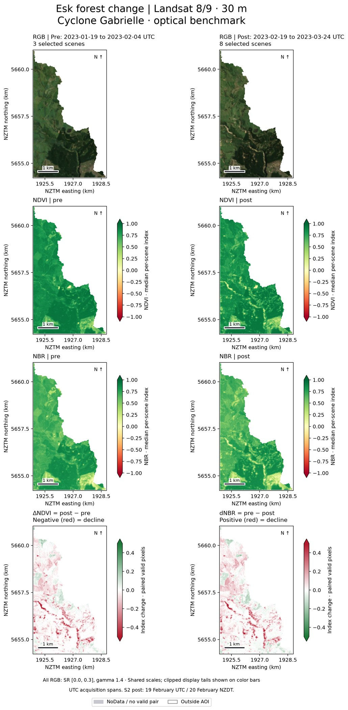
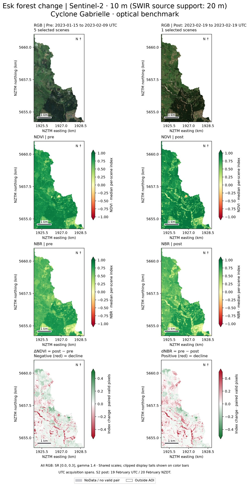
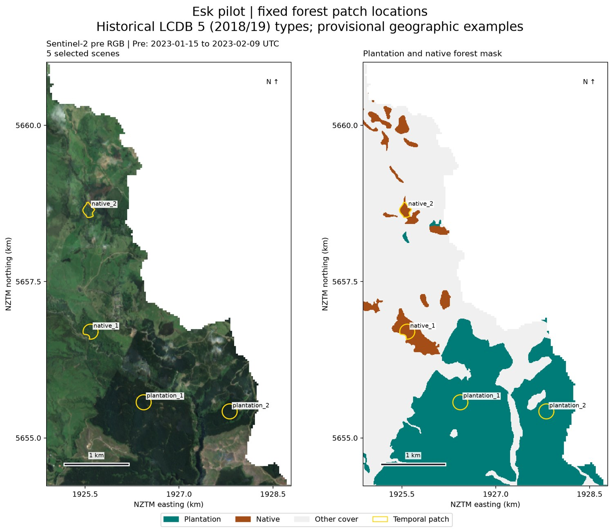
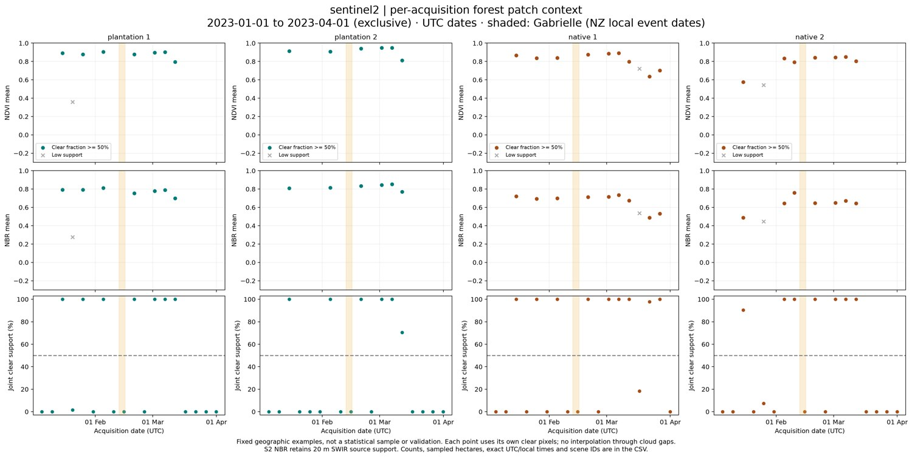
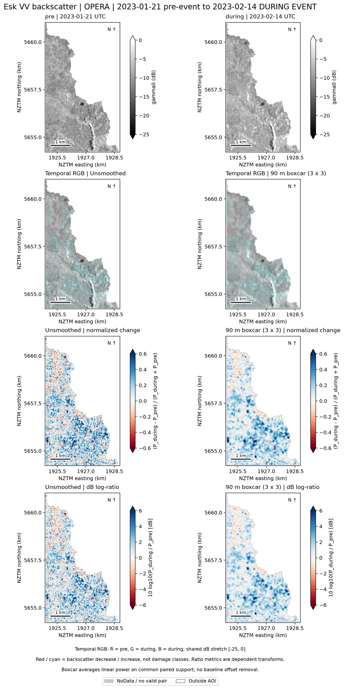
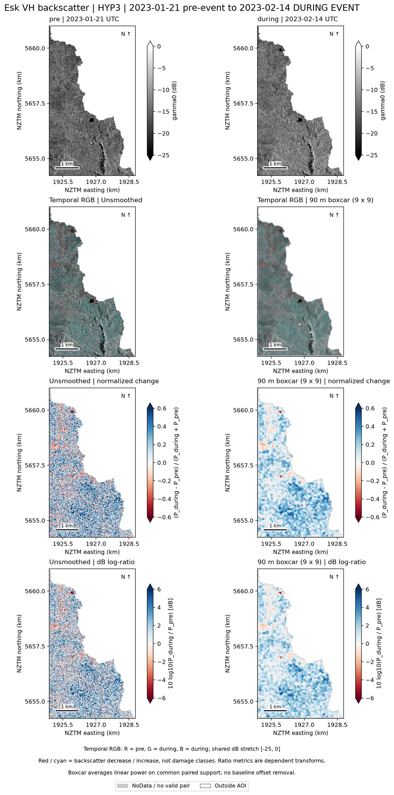

# Executed Esk forest-change benchmark

Executed on 10 September 2026, starting from implementation commit `94aabec`.
The optical benchmark ran first and its figures were inspected before OPERA,
then HyP3, were run separately. This is an observed descriptive analysis, not a
validated damage map or a classifier result.

## Optical findings

Both sensors show localized index declines, but their forest-wide averages differ.
Landsat has a longer later interval (19 February-24 March, eight scenes); Sentinel-2
has one later acquisition (19 February UTC / 20 February NZDT). Those differences,
seasonal response, masking and spectral support matter when comparing results.
The means below do not establish cyclone-attributable hectares of canopy loss.

| Sensor | Historical forest group | Paired ha | Missing ha | Mean delta NDVI (post-pre) | Mean dNBR (pre-post) |
| --- | --- | ---: | ---: | ---: | ---: |
| landsat | all forest | 584.91 | 0.00 | -0.0370 | +0.0308 |
| landsat | plantation | 528.48 | 0.00 | -0.0396 | +0.0328 |
| landsat | native | 56.43 | 0.00 | -0.0123 | +0.0119 |
| sentinel2 | all forest | 586.73 | 0.00 | +0.0071 | +0.0185 |
| sentinel2 | plantation | 529.80 | 0.00 | +0.0016 | +0.0233 |
| sentinel2 | native | 56.93 | 0.00 | +0.0584 | -0.0267 |

All forest pixels have a valid selected-composite pair for both indices in this
run. That does not prove freedom from residual cloud or other quality effects.
Native 10 m/30 m hectares differ because of rasterization at different grid spacing.

A separate comparison averages paired Sentinel-2 source pixels to the Landsat grid
and restricts both sensors to the same paired-valid 30 m support:

| Sensor | Common paired forest ha | Mean delta NDVI | Mean dNBR |
| --- | ---: | ---: | ---: |
| landsat | 577.08 | -0.0371 | +0.0310 |
| sentinel2_at_30m | 577.08 | +0.0065 | +0.0191 |

The original median per-scene NDVI/NBR data are reused. Only missing reflectance
was exported. Index-of-median-reflectance diagnostics remain separate variables.
Full forest-only maps, valid-count boards, shared-bin histograms, exploratory range
areas and CSV tables are saved in the run directory.

## Acquisition context

Each sensor's table has 18 acquisitions x four patches = 72 records, from 1 January
through 31 March 2023. Fully cloudy acquisitions remain as zero-support records.
Four saved examples were selected geographically, without inspecting their change
values; they do not represent a probability sample or independent validation.

| Patch | Geometric area (ha) |
| --- | ---: |
| plantation_1 | 4.52 |
| plantation_2 | 4.52 |
| native_1 | 4.08 |
| native_2 | 2.80 |

The time-series values come from per-acquisition Earth Engine reductions, not
saved composites. The CSVs include canonical scene IDs, UTC/local timestamps,
NDVI/NBR mean/median/count, sampled and clear hectares, and joint clear fraction.
Low-support points are flagged; no lines interpolate through cloud gaps. The
patch examples mostly retain high index values immediately after Gabrielle;
this does not contradict localized declines elsewhere in the AOI.

## Separate during-event SAR comparisons

The existing pair is 21 January to **14 February 2023 (during-event)**. On common
raw/smoothed forest support, mean dB log-ratios are:

| Product | Polarization | Common paired ha | Unsmoothed mean dB change | 90 m boxcar mean dB change |
| --- | --- | ---: | ---: | ---: |
| OPERA | VV | 561.96 | +1.467 | +1.497 |
| OPERA | VH | 561.96 | +1.772 | +1.778 |
| HYP3 | VV | 566.04 | +1.490 | +1.539 |
| HYP3 | VH | 566.04 | +1.778 | +1.793 |

The positive averages represent increased backscatter. They are not independent
confirmation of optical decline or a canopy-loss class. Normalized change in
linear power and dB log-ratio are dependent transforms of the same ratio.

Full VV/VH boards, temporal RGB, both ratio metrics, raw/smoothed distributions,
paired statistics and saved spatial profiles are available for each product.
The 90 m mask-aware boxcar is 3x3 OPERA pixels and 9x9 HyP3 pixels, applied in
linear power on the same valid neighbourhood support for both dates. It is a
comparison experiment, not a validated optimal filter or an exact reproduction
of the IEEE paper's unverified settings.

## Delivered files and checks

All working data remain below `G:\My Drive\FORE448\Group Project`.
Inside the repository:

- `data/stacks/forest_change/`: five compressed, labelled NetCDF datasets.
- `outputs/forest_change/figures/`: full-resolution PNG and editable vector SVG.
- `outputs/forest_change/rasters/`: twenty continuous optical/SAR change GeoTIFFs.
- `outputs/forest_change/`: paired statistics, range/bin tables, acquisition CSVs,
  profiles, provenance and verification records.
- `outputs/forest_change/executed_notebooks/`: executed copies of all eight notebooks.
- `notebooks/legacy/`: original notebooks; old outputs remain at their original paths.

38 tests pass. All sixteen primary/legacy notebook files pass JSON/syntax checks.
The eight primary notebooks were executed using the project Python interpreter.
NetCDF files were reopened and compared to their source arrays; saved changes,
paired tables, ratio identities and common support are independently checked by
`python -m pipeline.forest_run verify`. The preserved-input inventory checks that
raw inputs, original AOI, existing derived products and legacy outputs are unchanged.
The exact software versions are in `requirements-lock.txt`.

The runtime emits dependency compatibility/deprecation warnings for the installed
NumPy/NetCDF/rasterio combination; numerical and persistence checks pass. Jupyter's
protected connection-file ACL operation is unsupported on this mounted Drive, so
the checked-in execution helper runs real notebook cells in-process via IPython,
without writing a kernel connection key to Drive.

For scientific definitions, source collections, masks, intervals and limitations,
see [the methods](forest_change_methods.md). No independent aerial accuracy,
mechanism classification, ML or LiDAR result is claimed. LandTrendr remains later work.
