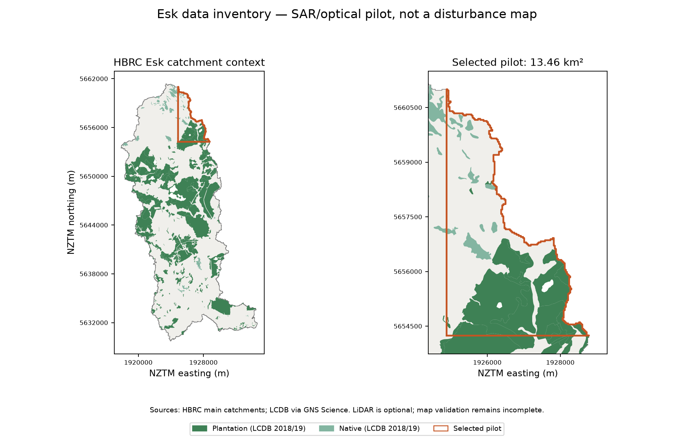

# Live inventory review

Metadata queries completed at **2026-09-09T23:07:13.381586+00:00** with **505 records and no provider errors**. The snapshot contains metadata and vector context only. No raw sensor rasters were downloaded, no HyP3 jobs were submitted and no observed disturbance map was produced.

## Selected SAR/optical pilot

The selected SAR/optical pilot is **13.464 km²**, with **39.38% plantation forest** and **4.23% native forest** from LCDB 2018/19. It is saved as `aoi/study_area.geojson`, with the selected scene list in `data/selected_inventory.csv`. The candidate file preserves the earlier exploratory ranking. Ranking uses forest coverage and forest-type balance within the authoritative catchment; same-orbit SAR and pilot-specific optical overlap determine eligibility. LiDAR is optional and does not affect eligibility or the default ranking. LiDAR DEM/DSM footprints have 100% spatial coverage of this candidate; that does not verify capture dates. Disturbance diversity still needs aerial/terrain review. The context figure shows the inventory geometry, not mapped disturbance.

HBRC’s main-catchment polygon is 267.855 km², larger than the approximate 252 km² in the scope. The full catchment is used only for metadata discovery and candidate ranking. The pipeline does not default to processing it.

## Sensor overlap verified for the candidate

- **SAR:** ascending relative orbit **81**, VV/VH. Two OPERA bursts pair **21 January 2023** with **14 February 2023**, at approximately **20:07 NZDT** on the event day. The matching pair of GRD scene IDs is available for a two-job HyP3 plan; 10 m RTC outputs have not been generated. Exact IDs are in [the audit](pilot_candidate_audit.json).
- **Sentinel-2:** five usable pre-event scene candidates (15/20/25 January and 4/9 February UTC) and **19 February 2023 UTC / 20 February NZDT** post-event. Their pilot-specific QA union passes the 90% requirement. This is a composite assessment, not a claim that every individual pre-event scene is clear.
- **Landsat 8/9:** three pre-event scenes and eight post-event scenes from the configured preferred windows pass the pilot composite check. The post composite spans **19 February–24 March UTC**. It must not be labelled a single event-day observation. See [pilot QA counts/fractions](pilot_optical_coverage.json).
- **LiDAR:** the pre 2020–2021, regional post 2023–2024 and event-specific 2023 DEM/DSM footprints overlap. Every selected-catchment LiDAR item in this snapshot repeats a collection capture interval. No exact tile flight date was inferred.
- **Aerial:** pre-event rural RGB/NIR and post-event Cyclone Gabrielle tile metadata are inventoried for later manual interpretation. Labels have not been created.

## Records

| Sensor | Product | Epoch | Records |
|---|---|---|---:|
| aerial | AERIAL | post | 234 |
| aerial | AERIAL | pre | 47 |
| aerial | AERIAL_NIR | pre | 17 |
| landsat | SR | post | 27 |
| landsat | SR | pre | 9 |
| lidar | DEM | post | 26 |
| lidar | DEM | pre | 17 |
| lidar | DSM | post | 26 |
| lidar | DSM | pre | 17 |
| sentinel1 | OPERA_RTC | post | 21 |
| sentinel1 | OPERA_RTC | pre | 29 |
| sentinel1 | S1_GRD | post | 9 |
| sentinel1 | S1_GRD | pre | 13 |
| sentinel2 | SR | post | 5 |
| sentinel2 | SR | pre | 8 |

[Full machine-readable inventory](data_inventory.csv) · [Audit](pilot_candidate_audit.json) · [Status](status.json)

## Capture intervals actually reported by the LINZ catalog

These are **survey intervals**, not independently verified per-tile flight dates:

| Dataset | Reported UTC interval |
|---|---|
| Pre regional | 2020-11-10 11:00Z to 2021-01-23 11:00Z |
| Post regional | 2023-09-19 12:00Z to 2024-04-26 12:00Z |
| Event river-flood LiDAR | 2023-02-25 11:00Z to 2023-03-14 11:00Z |

The late regional post data can include harvesting, silviculture and regrowth. Even event LiDAR is not an instantaneous 14 February measurement.

## Required for observed processing and validation

**LiDAR is an optional bonus and is disabled by default. Its unresolved metadata does not block this selected SAR/optical pilot.**

1. Retrieve the selected OPERA/HyP3 and optical products, prepare bounded mosaics, measure registration residuals and screen stable-reference polygons. SAR/optical stages are implemented; no real raster processing result is asserted in this inventory review.
2. Run the 30 m baseline and 10 m tier, then manually interpret stratified LINZ references. No real accuracy, disturbed-area total or calibrated real-data threshold is available yet.
3. If LiDAR is added later, verify its per-tile dates and vertical datum using the optional override contract. No further LiDAR retrieval or investigation is required for the MVP.

[Selected inventory](selected_inventory.csv) · [Selected study polygon](../../aoi/study_area.geojson)

## Verification

The software has 31 offline tests, including end-to-end synthetic stage tests both with and without LiDAR, and safe-default execution checks for all eight notebooks. Synthetic outputs are separated under `outputs/synthetic_demo` and are never presented as observations.
